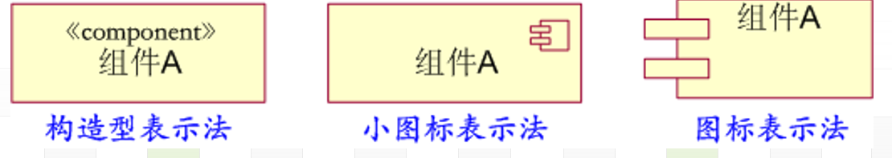

# uml
* uml (统一建模语言，Unified Modeling Language),软件和系统开发的标准语言，它主要以图形的方式对系统进行分析、设计。
* *uml模型只描述了一个系统要做什么，并没告诉我们系统是如何被实施的。
* 对业务建模、对要构造的软件建模。
---
#### 面向对象开发
* 面向对象(Objec-Oriented,OO)。
* 面向对象的优点： 自然醒和重用性。
* OO开发三层设计：问题域类、GUI类和数据访问类。
* 设计步骤：
  * 描述需求
  * 根据需求建立系统的静态模型，以构造系统
  * 描述系统的行为
**UML的发展**
* 20世纪80年代： 尝试不同方法进行面向对象的分析＆设计
* 20世纪90年代中期：第二代面向对象方法

**模型、图**
图分为结构图和行为图。
结构图：
* 类图
  * 展示了系统中静态事物、它们的结构以及它们之间的相互关系。用来描述系统的逻辑设计和物理设计。
* 构件图
  * 构件图展示一组构建的组织和彼此间的依赖关系。构件图说明系统如何实现，软件系统内构建如何协同工作。
* 对象图
  * 展示系统的一组对象。 是系统、类图在某一时刻的快照。
* 部署图
  * 部署图展示物理系统运行时的架构。描述系统中硬件和硬件上驻留的软件。
* 组合结构图
  * 展示模型元素的内部结构
* 包图
  * 包图描绘包之间的依赖关系。(包是一个用于组织其他模型元素的通用模型元素)
* 用例图
行为图：
* 活动图
  * 显示系统内的活动流。
* 状态图
  * 状态图显示一个对象状态和状态之间的转换。状态图包括状态、转换、事件和活动。状态图是一个动态视图，对事件驱动的行为建模尤为重要。
* 合作图
  * 合作图是交互图的一种。 合作图突出对象之间的合作与交互，现被通信图取代，
* 顺序图
  * 另一种交互图。强调传递消息的时间顺序。
* 时间图
  *  交互图。 描绘与交互元素的状态转换or条件变化有关的详细时间信息。
* 交互概述图。 高层视图，从提上显示交互序列之间的控制流。
**视图**
* 视图由多个图构成，不是一个图表而是系统的抽象表示。
* 视图有以下几种：
  * 用例视图： 表示外部参与者看到的系统将提交的功能。
  * 逻辑视图：表示系统内部如何提供系统的功能。
  * 构件视图：表示代码构件的组织，描述了实现模块及依赖关系。
  * 进程视图：表示系统的并发性，包括通信和同步。
  * 部署视图：表示系统的物理布置。描述构件被部署到物理结构中的映射。
**UML主要特点**
* 统一了Booch、OMT和OOSE等方法中的基本概念。
* 吸取了面向对象技术领域其他流派的长处。
* 在演变过程中提出了新的概念。
**两个建模**
* 业务建模目的：理解业务内容和业务过程。将计划和决策文档化。
* 软件建模:用uml表示软件的体系and组成，方便软件设计人员理解和修改软件方案。
**为什么使用UML**
uml是一种公共的、应用广泛的、有很好的扩展性的语言。
**模型种类**
* 产生模型的阶段性分类： 业务模型、需求模型、设计模型、实现模型、数据库模型。
* 用途分类： 功能模型、对象模型、动态模型。
---
### uml的体系与类
* uml语言时设计语言，由构造元素、规则和公共机制构成。

* 构造元素：包括基本元素、关系、图。
* 规则：包括 命名、范围、可见性、完整性和执行等属性。
* 包括详述、修饰、通用划分、扩展机制。
**基本元素**
结构元素、行为元素、分组元素、注释元素。
* 结构元素：定义了业务or软件系统中的某个物理元素，描述了事物的静态特征。 结构元素有7种，分别是：类、对象、接口、主动类、用例、写作、构件、节点。
* 行为元素： 描述业务or软件系统中事物之间的交互or事物的状态变化。行为元素有两种： 交互，状态机。
* 分组元素： 包。
* 注释元素：对其他元素的解释部分。
**关系元素**
* 关联关系、实现关系、泛化关系、扩展关系和依赖关系五种
**规则**
最常见： 命名、范围、可见性。
公共机制： 规格描述、修饰、通用划分、扩展机制。
扩展机制：通过一些方法对基本元素进行扩展，扩展机制有：构造型、标记值、约束。
* 构造型：构造新的uml元素。
* 表示构造型的符号：
  * 用符号《》
  * 用新图标
  * 二者结合
* 标记值： 为事物添加新特征。用法："{标记信息}"
* 约束：标识元素之间的约束条件，用来增加新的语义或改变已存在规则的一种机制。表示方法和标记值类似。
**属性**
属性是类的一个特性，描述了类的对象所具有的一系列特性值。
**操作**
操作是类能够做的事情，or别的类能对这个类做的事情。
**职责和约束**
* 类图标可以指明另一种类的信息，在操作列表框下面的区域，可以用来说明类的职责。职责描述了类做什么(类的属性和操作能完成什么任务) 

uml提供了另一种方式表示施加约束，以便模型元素的语义定义更加明确，被称为对象约束语言(ObjectConstraint Language,OCL). OCL 是 UML 的一个高级但很有用的工具，有自己的规则、术语和操作符。
* 类代表的是领域知识中的词汇和术语。
--- 

#### 关系
* 关系说明了这些词汇所表达的概念之间的连接，这样才能完整说明被建模型。
---
**关联**
* 当类之间在概念上有连接关系时，这种关系叫关联。
* 关联是类之间最基础的概念性连接。关联中每个类都扮演某种角色，关联的多重性说明了一个类的多少对象能够和另一个类的单个对象发生联系。

用箭头表示连接。
**关联类**
* 关联也有自己的属性和操作，因此关联可以改成关联类。 关联类需要用虚线相连。
**链**
* 关联的实例
**多重性**
* 某个类有多个对象可以和另一个类的单个对象关联。
> uml使用(*)代表许多or多个，两点或者(,)表示or关系。

**限定关联**
* 在uml中，id信息被称为限定符(qualifier).

**自身关联**
* 类与它自身发生关联。

**继承和泛化**
* 继承是面向对象的术语，uml称之为泛化。
* uml中，用父类到子类之间的连线来表示继承关系，指向父类的一端带一个空心三角形箭头。连接含义"is a kind of".
* 抽象类只是为了提供其他类继承的基类之用，本身不产生对象实例。

**依赖**
* 一个类使用了另一个类，最常见的依赖关系是： 一个类操作的型构中用到了另一个类的定义。
* 依赖关系用从依赖类到被依赖类的带箭头的虚线表示。

---
#### 聚集、组成、接口、实现
---
**聚集**
* 一个类有时是由几个部分类组成的，这种特殊类型的关系被称为聚集。部分类和由它们组成的类之间是一种整体与部分的关联。
* 聚集关系构成了一个层次结构，“整体”类位于层次结构的最顶部。
* 连接和泛化相似。
* 聚集有传递性。
* 有时一个聚集体可能有多种部分组成，这些部分体之间是“or”关系。 连接方式是：虚线连接，花括号添加备注{or}.
**组成(复合 Composition)**
* 组成是强类型聚集，聚集中的每个部分体只能属于一个整体。组成表示法和聚集表示法类似，但箭头是实心。

**组成结构图(Composite Structure Diagram)**
* 一种类型的组成结构图就是将一个类画成一个大矩形框。

**接口和实现**
* 接口(interface)是描述类的部分行为的一组操作，也是一个类提供给另一个类的一组操作。
* 接口的模型和类表示大致相同，但没有属性，只有操作。
* 类和接口之间的关系被称为实现，实现关系用一个带空心三角形箭头来表示，箭头的方向指向接口。
* 另一种表示法(省略表示法)，将接口表示为一个小圆圈，并和实现它的类用一条线连接起来。

* 实现符号和继承符号差别： 实现关系：虚线，继承关系，实线。
* 一个类可以实现多个接口，一个接口也可以被多个类实现。
  
**可见性**
 * 可见性用于属性or操作，说明在给定类的属性和操作的情况下，其他类可以访问到属性和操作的范围。
 * 可见性的3种层次：
   * 公有(public)层次： 其他类可以直接访问这个层次的属性和操作
   * 受保护(protect) 层次： 只有继承了这些属性和操作的子类可以访问最初类的属性和操作。
   * 私有(private): 只有最初的类才能访问。
   * 属性or操作前：+:共有 #:受保护 -：私有

**作用域**
* 存在两种作用域：
  * 实例作用域：每个实例对象都有自己的属性和操作
  * 分类作用域： 一个类的所有实体只存在一个属性值和操作
  * 具有分类作用域的属性和操作名字要带下划线，通常用在一组实例必须共享某个私有属性值的情况下

**类的种类**
uml分为三个类： 
* 边界类(Boundary Class)
  * 用于描述外部参与者与系统之间的交互
* 实体类(Entity Class)
  * 实体类主要作为数据管理和业务逻辑处理层面上存在的类别。
* 控制类(Control Class)
* 控制类用于描述一个用例所具有的事件流控制行为，控制一个用例中的事件顺序。

---
#### 包图

---
* 概念： 包是一种常规用途的组合机制。UML种的一个包直接对应Java的一个包。在建模时，通常使用逻辑性的包，用于对模型进行组织；使用物理性的包，转换成系统中的java包。
* 包图时描述包及其关系的图。包图可以包括注释约束、包之间有依赖关系和泛化关系。
* 作用 ： 对语义上相关的元素进行分组，把功能相关的用例放在一个包中。
  * 提供配置管理单元。
  * 在设计时，提供并行工作单元。
* 包中的元素： 各种：类、接口、构件、节点、协作、用例
* 包的表示：和文件夹差不多。
* 包的属性： public,protect,private.
* 包的构造型：
  * <<[system]>>: 表示整个系统
  * <<[subsystem]>>:表示正在建模的系统中的某个独立子系统。
  * <<[facade]>>:包的视图，只包含对另一个包所拥有的模型元素的引用。
  * <<[stub]>>:代理包，服务于某个其他包的公共内容
  * <<[framework]>>:框架
* 包的关系： 依赖关系，泛化关系
  * 依赖关系：
    * use:默认依赖关系。使用元素
    * import:添加
    * access:只提供元素，不合并包
    * trace: 一个包到另一个包的历史发展
  * 泛化：
    * 类似于类
* 良好的包结构： 包内高内聚，包间低耦合。
* 包图建模：
  * 对组成元素建模
  * 对体系结构建模

---
#### 用例图
* 用例能够帮助分析员从用户的观点收集需求。
---

用例的特征：
* 总由角色初始化
* 为角色提供值
* 具有完全性

用例是能够帮助系统分析员和用户确定系统使用情况的uml组件。可以认为用例是系统的一组使用场景。每个场景描述了一个事件的序列。每个序列由一个人、另一个系统、一个硬件设备或者某段时间的流逝所发起。

重要性：
* 用例是一个能促进系统可能的用户以他们自己的观点看待系统的优秀工具

用例用椭圆形表示，人物形状表示参与者。

#### 状态图
* 状态图也叫状态机(state machine)或状态表(statechart),状态图只是对单个对象建立模型。
* 符号集： 
* 
* 状态图被划分成三个区域(名字、属性和操作区域)。
* 活动：入口动作(entry),出口动作(exit),动作(do).
* 触发器事件：添加在线上
* 子状态：顺序子状态，并发子状态
  * 并发子状态同时进行，之间用虚线隔开。
* 在接受对象的状态图中，能够除法一个状态转移的消息叫做信号(singal)

小结：系统中的对象改变自身的状态以响应事件和时间流逝，UML状态图就能捕获这些状态变化。状态图的焦点是一个对象的状态变化，用圆角矩形表示，状态转移用带箭头的实线表示，它指向目标状态，。
状态还可以包含子状态，子状态分为顺序子状态和并发子状态。包含子状态的状态被称为组成状态。
历史状态是说明一个组成状态在对象转移出该组成状态之后还能记住的子状态。历史状态有深浅两种，浅的只能记忆最顶层子状态，深的可以记住所有。

---
### 顺序图
* 顺序图更进一步显示出随着时间的变化对象之间是如何通信的。
* 顺序图的关键思想是对象之间的交互是按照特定的顺序发生的，这些按特定顺序发生的交互序列从开始到结束需要一定的时间。
* 顺序图的组成： 对象用矩形框表示，其中是带下划线的对象名。消息用带箭头的实线表示，时间用垂直虚线表示。
* 激活：激活表示该对象正在执行某个操作。激活矩形的长度表示激活的持续时间。
* 消息： 消息分为简单的、同步的和异步的。
  * 简单： 一个对象到另一个对象的控制流转移
  * 同步: 一个对象发送了一个同步消息，必须等待另一个对象应答。
  * 异步： 不需要应答。
* 在顺序图中： 简单消息是简单箭头，同步消息是实心箭头，异步消息是半边箭头。

* 顺序图中，自左到右代表对象的布局，自顶向下表示时间的流逝。

小结：
uml顺序图在对象交互的表示中加入了时间维。

---
### 协作图
* 协作图是与顺序图类似的一种UML图，顺序图强调交互的时间吮吸，协作图强调的是交互的语境和参与交互的对象的整体组织，展示对象之间的交互，但绘图方式与顺序图不同。
* 顺序图按照时间顺序布局，协作图按照空间组织布局。
* 协作图是对象图的扩展，除了展示出对象之间的关联，还显示出对象之间的传递。(通常在协作图中省略掉关联的多重性)

* 在图中可以重复画出标注了不同状态的同一对象的图标，并用带箭头的虚线连接起来，并在虚线上使用构造型<<[become]>>来表示对象的状态变化
* 在多对象前面用方括号括起来条件，前面加一个"*"号。
* 返回值： 返回值的名字在最左，后跟赋值号": = "，接着是操作名和操作的参数。
* 主动对象： 一些交互中的控制流是有一个特定的对象控制的，这样的对象叫主动对象。主动对象的矩形框边界要加黑加重。
* 同步： 在需要同步的消息之前列出这个消息之前要传递的消息序号，序号之间用逗号分开，最后用反斜杠与需要同步消息隔开。

小结： 协作图是表达顺序图中所有信息的另一种uml图。展示了对象和对象之间的关联，展示了对象之间的消息传递。关联线旁的消息箭头代表一个消息，消息前的序号代表消息发送的事件顺序。

---
#### 活动图
* 活动图用于uml中建立动态模型，主要描述系统随时间变化的行为，这些行为是从静态视图中抽取的系统的瞬间之变化来描述的。在uml1中，它是一种特殊形式的状态机，用于对计算机流程和工作流程建模。在uml2中，它具有基于petri网的完整新语义。
* 活动图表示在处理某个活动时，两个或者更多类对象之间的过程控制流。
* 目的： 描述一个操作执行过程中所完成的工作
  * 描述对象内部工作
  * 显示如何执行一组相关的侗族，以及这些动作如何影响它们周围的对象。
  * 显示用例的实例如何执行动作以及如何改变对象状态。
  * 说明一次业务流程中的人和对象是如何工作的。
* 活动图从本质上说是一个流程图，但它能够展示并发和控制分支，显示出工作步骤(活动)、判定点和分支。用于描述业务过程和类内操作。
**活动图用圆角矩形表示，但比状态图图标更窄，更接近椭圆。活动图的起点用实心圆表示，终点公牛眼**
* 判定： 流程图一样+菱形或者直接省略。
* 并发路径： 可以用一个与转换线垂直的黑色粗实线条表示，并发的路径从这个实线条引出。而并发活动路径的合并也用这个黑色实线条表示。

* 信号： 活动序列中的活动可以发送信号。发送信号的图符是一个凸角五边形，接受的是凹角。

* 活动图还可以增加角色的可视化维数。将图分割成多个平行的段，这些段被称为泳道。
* 交互概述图： 将活动图和顺序图嫁接在一起的图。
  * 一种以活动图为主线，对活动图中某些重要的活动节点进行细化。对工作流建模。
  * 另一种以顺序图为主线，用活动图细化顺序图中某些重要对象。对操作建模。

---
#### 构件图
* 概念: 构件是软件系统的一个物理单元，驻留在计算机中。
* 数据表、数据文件、可执行文件、动态链接库、文档都被定义为构件。
* 构件组成：五个要素：
  * 接口声明
  * 接口实现
  * 构建标准
  * 封装方法
  * 部署方法
* 构件和构件的关系建立模型用途：
  * 使客户看到最终系统的结构
  * 让开发者有一个工作目标
  * 让编写技术文档和帮助文件的技术人员能理解所写内容
  * 利于重用
* 配置构建： 组成系统的基础构件，是执行其他构件的基础平台。如：动态链接库等。
* 工作产品构件：开发过程的中间产物。创建构件时的源代码文件及数据文件都属于工作产品构件。
* 执行构件：在运行时创建的构件。
* 构件图是描述构件及构件关系的图。
* 构件图的表示：

构件的接口: 供给接口(一条实现链接到矩形上的圆圈)为其他构件提供服务、所需接口使用其他构件为其服务(半圆)

---
#### 部署图
* 用来显示系统中软件和硬件的物理架构。
* 部署图描述了系统中包括的计算机和其他的硬件设备。
* 部署图的作用：
  * 描述系统投产的相关问题
  * 描述系统与生产环境中其它系统间的依赖关系，这些系统可能是已经存在or将要引入。
  * 描述一个商业应用主要的部署结构
  * 设计一个嵌入系统的硬件和软件结构
  * 描述一个组织的硬件、网络基础结构
* 部署图组成元素：
* 节点、节点间的连接。
* 节点: 处理器<[Processor]>和设备<[Device]>
