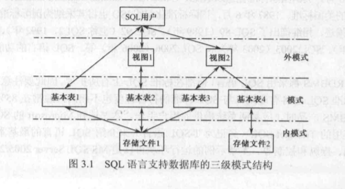

# 数据库
---
## 第三章 关系数据库语言SQL——数据库应用基础
---
### 1. SQL 概述
#### SQL的特点
* 综合统一
  * 集数据定义语言DDL，数据操纵语言DML，数据控制语言DCL于一体
* 高度非过程化
* 面向集合的操作方式
* 以同一种语法结构提供两种使用方式
  * 既是自含式语言，又是嵌入式语言
* 语言简洁，易学易用
  * 9个核心动词：SELECT,INSERT,UPDATE,DELETE,CREATE,DROP,ALTER,GRANT,REVOKE.
#### SQL的基本概念
* SQL支持数据库的三级结构
  
  * 基本表(Base table)
  * 视图(View)
  * 存储文件
  * 索引
  * 模式
#### SQL的组成
* 数据定义语言DDL(Data Definition Language)
* 数据操纵语言DML(Data Manipulation Language)
* 数据控制语言DCL(Data Control Language)
#### SQL的嵌入式与会话规则
* 嵌入式与主语言接口
  * 定义嵌入式和动态SQL规则，
* 调用与会话规则
  * SQL提供远程调用功能，远程方式下客户课通过网络调用数据库服务器中的存储过程。
#### SQL语句的分类
* 数据定义：创建、更新和撤销模式及其对象，Create、DROP,ALTER.
* 数据查询：select
* 数据操纵：完成数据库的数据更新，INSERT,UPDATE,DELETE
* 数据控制：进行数据库的授权、事务管理和控制：GRANT,REVOKE,COMMIT,ROLLBACK.
#### SQL 数据类型
|数据类型|  含义|
|------| :--------------: |
|int| 整数|
smallint|短整数
bigint| 大整数
decimal(p,q)|定点数，由p位数字(不包含符号、小数点)组成，小数后面有q位数字，q的默认值为0.
numeric(p,q)| 同上
float|浮点数 8字节
real|浮点数 4字节
bit|位型，取值为0，1，1字节  若赋非0值，取值为1
char(n)|定长字符串，n为字符串的长度，范围为1~8000，默认为1
varchar(n)|变长字符串，n为字符串的最大长度，范围默认值同上
nchar(n)|n个字符的固定长度Unicode字符型数据，n取值范围为1~4000，默认为1，存储长度为输入字符个数的两倍。
text|文本型，存储长度与实际相当
ntext|Unicode字符型数据，存储长度是实际的两倍
datetime|日期时间类型，8字节。  范围： 1753.1.1-9999.12.31
smalldatetime|短日期时间类型，4字节。 范围： 1900.1.1-2079.6.6
binary(n)|定长二进制数据，n为数据长度，n取值1~8000
varbinary(n)|可变长度二进制数据，n为最大长度
image|图像数据类型，可存储多种格式文件，如word、execl、bmp、gif、jpg,可变长度二进制数据。

### 数据定义

* 包括数据库模式定义，基本表定义，视图定义和索引定义。

#### 模式定义
* 模式定义即定义一个存储空间。
  |操作|语句|
  |:----:|:----:|
  创建数据库 |CREATE DATEBASE<数据库名>
  使用数据库 |USE <数据库名>
  修改数据库 |ALTER DATEBASE<数据库名>
  删除数据库 |DROP DATEBASE<数据库名>

#### 基本表定义

**1. 定义基本表**
*语句：CREATE TABLE<基本表名>
(
  <列名><数据类型>[<列级完整性约束>]
  { ,<列名><数据类型>[<列级完整性约束>]}
  [,<表级完整性约束>]
)
> 巴科斯范式：(Backus-Naur Form, BNF)
> 
> 尖括号<>表示必选项
> 
> 方括号[]表示可出现一次或不出现
> 
> 花括号{}表示可不出现或出现多次
> 
**列级完整性约束**
|语句| 效果|
|----|:----:|
NOT NULL| 非空约束，限制列取值不能为空
DEFAULT|默认值约束，指定列的约束值
UNIQUE|唯一性约束，限制列的取值不能重复
CHECK|检查约束，限制列的取值范围
PRIMARY KEY| 主码约束，指定本列为主码
FOREIGN KEY|外码约束，指定本列为引用其他表的外码，格式为[FOREGIN KEY(<外码列名>)]REFERENCE<外表名>(<外表列名>)

**修改基本表**

* ALTER TABLE语句用于更改基本表的结构

> ALTER TABLE <基本表名> 
> 
> ALTER COLUMN<列名><新数据类型>[NULL|NOT NULL] &emsp; ---修改已有列定义
> 
>   &emsp; ADD<列名><数据类型>[约束] &emsp;  ---增加新列
> 
>   &emsp; DROP COLUMN <列名> &emsp; &emsp;---删除列
> 
>   &emsp; ADD[CONSTRAINT<约束名>] <约束定义>  &emsp; &emsp;---添加约束 
> 
>  &emsp;  DROP CONSTRAINT <约束名> &emsp; &emsp;---删除约束

**删除基本表**
> DROP TABLE<基本表名>

#### 索引定义
* 概念
  * 在数据库中，索引使数据的查找不需要对整个表进行扫描即可找到所需数据。
  * 数据库索引也是一个数据表的辅助结构，它著名了表中各行数据所在的存储位置。
* 条件：
  * 索引需要占用一定的存储空间  
  * 在对数据表进行插入、删除或修改操作时，需要对索引进行维护。
* 分类： 
  * 聚簇索引： 与数据是一体的，不适用于建立在频繁更改的列上。 一个数据表只能建立一个聚簇索引。
  * 非聚簇索引：具有完全独立于数据的索引结构。 一张表上可建立多个非聚簇索引。
  
**建立和删除索引**
*建立索引使用语句 CREATE INDEX，删除索引使用语句DROP INDEX。
> CREATE [UNIQUE][CLUSTERED|NONCLUSTERED]&emsp;&emsp; ---CLUSTERED 聚簇索引  NONCLUSTERED 非聚簇索引    
> INDEX <索引名> 
> ON <基本表名>(<列名>[ASC|DESC][{,<列名>[ASC|DESC]}...])     &emsp; ---ASC:升序   DESC：降序  
> DROP INDEX<基本表名>.<索引名>  

### 4.数据查询
#### SELECT 语句查询
* 基本格式：
> SELECT[ALL|DISTINCT]<目标列表达式>[,<目标列表达式>]...
> FROM<表名或视图名>[,<表名或视图名>]...
> [WHERE<条件表达式>]&emsp;&emsp;---WHERE子句，指定查询条件
> [GROUP BY<列名 1>]&emsp;&emsp;---GROUP BY子句，指定分组表达式
> [HAVING<条件表达式>]&emsp;&emsp;---HAVING子句，指定分组过滤条件
> [ORDER BY <列名2>[ASC|DESC]]&emsp;&emsp;---ORDER子句，指定排序表达式和顺序

* select语句结构中各子句的作用如下：
  * 1. SELECT 子句：指出输出的分量
  * 2. FROM 子句： 指出数据来源于哪些表或视图。
  * 3. WHERE 子句： 指出对元组的过滤条件
  * 4. GROUP BY 子句： 将查询结果集按指定列分组
  * 5. HAVING 子句： 指分组的过滤条件
  * 6. ORDER BY 子句： 将查询结果集按指定列排序

* Case 表达式：  替换查询结果中的数据
> CASE
> &emsp;&emsp;    WHEN 条件1 THEN 表达式1
> &emsp;&emsp;    WHEN 条件2 THEN 表达式2
> ...
> &emsp;&emsp;     ELSE 表达式
> END

* 常用查询条件：

| 查询条件 | 谓词 |
| :-----: | :-----: |
|比较运算| <=、<、=、>=、>、<>、!=、!>、!<
指定范围|BETWEEN AND、NOT BETWEEN AND
确定集合| IN 、NOT IN
字符匹配| LIKE,NOT LIKE
空值比较|IS NULL， IS NOT NULL
逻辑运算| AND，OR，NOT

* 常用的聚合函数
  
|函数名|说明|
|:----: |:----: |
AVG|求组中值的平均值
COUNT|求组中项数，返回int类型整数
MAX| 求最大值
MIN|求最小值
SUM|返回表达式中所有值的和

**聚合函数遵循以下规则**

 1. 带有一个聚合函数的SELECT语句仅产生一行作为结果
 2. 聚合函数不允许嵌套
 3. SUM、AVG、COUNT、MAX和MIN忽略空值，而COUNT(*)不忽略
 4. 聚合函数只能用在SELECT、GROUP BY 和HAVING 子句中。
