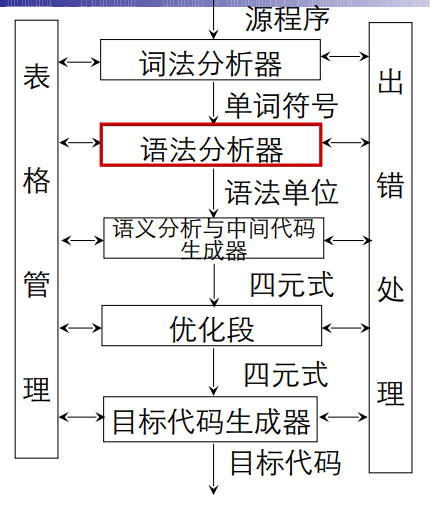

# 第五章-自下而上分析
---

---
## 自上而下分析法
 #### 基本思想
 * 从文法开始符号出发，反复使用各种产生式，寻找匹配的推导
#### 递归下降分析法
   * 对每一语法变量构造一个相应的子程序，每个子程序识别一定的语法单位
   * 通过子程序间的相互调用实现对输入串的识别
 #### 预测分析程序
   * 非递归实现
   * 直观、简单

### 自下而上分析法(Bottom-up)
#### 基本思想
* 从输入串开始，逐步进行归约，直到文法的开始符号
* 归约： 根据文法的产生式规则，把产生式的右部替换成左部符号
* 从树末端开始，构造语法树
#### 算符优先分析法
* 按照算符的优先关系和结合性质进行语法分析
* 适合分析表达式
#### LR分析法
* 规范归约
#### 移进-归约思想
* 用一个寄存符号的先进后出栈，把输入符号一个一个地压进栈里，当栈顶形成某个产生式地候选式时，就把栈顶这一部分归约成该产生式地左部符号
### 短语、直接短语、句柄

* 令G是一个文法，S是文法的开始符号，假定$\alpha\beta\delta$是文法G的一个句型，如果有$S\overset*\Rightarrow  \alpha A\delta$ 且$A\overset+\Rightarrow\beta$

则β称是句型$\alpha\beta\delta$相对于非终结符A的短语。

特别的： 若有$A\Rightarrow \beta$ 则称β是句型$\alpha\beta\delta$相对于规则$A \rightarrow \beta$的直接短语。
*  一个句型的最左直接短语成为该句型的句柄

* 在一个句型对应的语法树中
  * 以某非终结符为根的**两代以上的子树的所有末端结点从左到右排列**就是相对于该非终结符的一个短语。
  * 如果子树只有两代，则该短语就是**直接短语。**

#### 规范归约
* 定义：假定α是文法G的一个句子，我们称序列
$$\alpha_n,\alpha_{n-1},…,\alpha_0$$
是α的一个规范归约，如果此序列满足：

1. $\alpha_n = \alpha$
2. $\alpha_0$为文法的开始符号，即$\alpha_0 =S$ 
3. 对任何i,0≤i≤n,$\alpha_{i-1}$是从$\alpha_i$经把句柄替换成为相应产生式左部符号而得到的。

* **规范规约**是**最右推导**的逆过程。
* **最左归约**是**规范推导**的逆过程。
* 由规范推导推出的句型成为规范句型。

#### 符号栈的使用

$$
文法：G（E）:
\begin{cases}
  E→T|E+T\\
  T→F|T*F\\
  F→(E)|i
\end{cases}
$$

输入串 $i_1*i_2+i_3$

| 步骤 |  符号栈  |     输入串     |    动作     |
| :--: | :------: | :------------: | :---------: |
|  0   |    #     | $i_1*i_2+i_3$# |    预备     |
|  1   |  #$i_1$  |  $*i_2+i_3$#   |     进      |
|  2   |    #F    |  $*i_2+i_3$#   | 归，用F→$i$ |
|  3   |    #T    |  $*i_2+i_3$#   |  归，用T→F  |
|  4   |   #T*    |   $i_2+i_3$#   |     进      |
|  5   | #T*$i_2$ |    $+i_3$#     |     进      |
|  6   |   #T*F   |    $+i_3$#     | 归,用F→$i$  |
|  7   |    #T    |    $+i_3$#     | 归，用T→T*F |
|  8   |    #E    |    $+i_3$#     |  归，用E→T  |
|  9   |   #E+    |     $i_3$#     |     进      |
|  10  | #E+$i3$  |       #        |     进      |
|  11  |   #E+F   |       #        | 归，用F→$i$ |
|  12  |   #E+T   |       #        |  归，用T→F  |
|  13  |    #E    |       #        | 归，用E→E+T |
|  14  |    #E    |       #        |    接受     |

---

## 算符优先分析算法

* 起决定作用的是相邻的两个算符(终结符)之间的优先关系。
* 所谓算符优先分析法就是定义算符(终结符)之间的某种优先关系，借助于这种关系寻找“可归约串”和进行规约。

##### 优先关系 

优先关系是位置敏感的。

* 如果一个算符文法G中的任何终结符对(a,b)至多只满足下述三关系之一：
  $$
  a=b,a>b.a<b
  $$
  

则称G为算符优先文法。

#####  构造优先关系表算法

