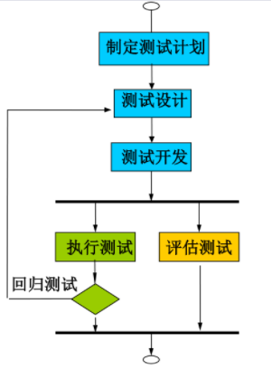
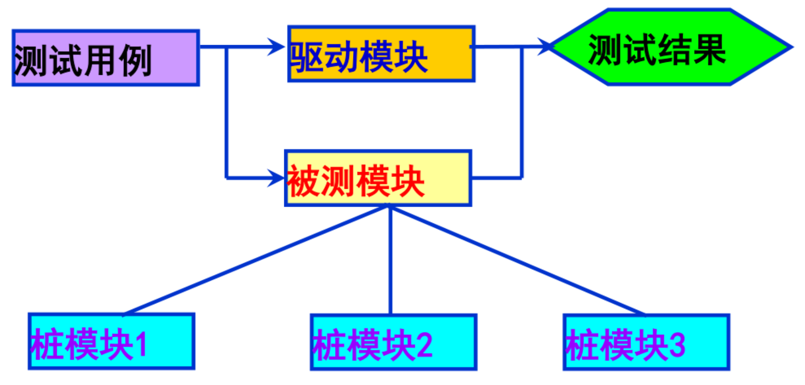
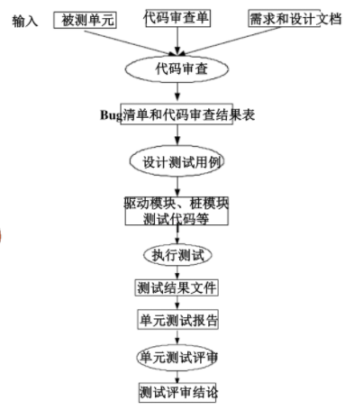

# 单元测试 
---
单元测试->集成测试-> 系统测试->验收测试
* 单元测试又称模块测试，是针对软件设计的最小单元，进行功能、性能、接口和设计等正确性检验的测试工作。
* 单元测试的内容包括：单元的内部结构、单元的功能和可观测行为。
* 单元测试方法分为人工测试和自动化测试。
* 面对不同语言测试对象不同：
  * 结构化编程语言： 函数or子过程。
  * 面向对象语言: 类or类的方法。
* 单元测试目的： 更准确、全面的找到错误，显著提高软件质量。
  * 能够大量削减开发时间和成本。
  * 能够尽早发现错误
* 单元测试原则：
  * 应尽早地进行软件单元测试
  * 应该保证单元测试的可重复性
  * 尽可能地采用测试自动化的手段来支持单元测试活动。
* 单元测试过程：
  * 制定测试计划
  * 单元测试设计
  * 测试执行
  * 测试评估

* 单元测试意义
  * 对软件的设计实现：
    * 保障软件质量、降低成本、更清晰的认识设计流程
    * 架构反思
    * 代码易于维护
    * 改善团队沟通
  * 对软件开发者
    * 更清晰地认识设计规格说明书
    * 提高代码静态分析技能
    * 编码规范 
    * 学习机会
#### 单元测试内容
* 在单元测试时，要依据详细设计说明书和源程序清单，主要采用白盒测试的测试用例并辅之以黑盒测试的测试用例，使之对任何合理的输入和不合理的输入，都能鉴别和响应。
* 单元测试主要对模块的五个基本特性进行评价:
  * 模块接口
  * 局部数据结构
  * 边界条件
  * 错误处理
  * 重要的执行路径
* 单元测试任务：
  * 1. 模块独立执行路径测试
    * 检查每一条独立执行路径的测试。保证每一条语句至少被执行一次。
  * 2. 模块局部数据结构测试
    * 检查局部数据结构完整性
  * 3. 模块接口测试
    * 检查模块接口是否正确。
  * 4. 模块边界条件测试
    * 检查临界数据处理的正确性
  * 5. 模块的各条错误处理路径测试
    * 预见、预设的各种出错处理是否正确有效。
* 单元测试人员：
  * 开发者本人or 独立的专业测试人员

#### 单元测试方法以及环境
**静态测试技术**
* 静态代码分析
  * 不运行被测试程序，对代码通过检查、阅读进行分析。
  * 代码走查(Code Walkthrough),代码审查(Code Inspection),代码评审(Code Review).
    * 走查：采用讲解、讨论和模拟运行的方式进行查找错误的活动
    * 审查：采用和讲解、提问方式进行，一般有正式的计划、流程和结果
      * 主要方法有缺陷检查表
    * 评审：在审查会后进行，根据记录和报告进行评估。

* **动态测试技术**
  * 单元结构测试(白盒测试)
  * 单元功能测试(黑盒测试)
* 驱动模块
  * 被测基本单元的主程序，接收测试数据，并把数据传送给被测单元，最后输出实测结果。
  * 即对底层or子层模块进行测试所编写的调用这些模块的程序
* 桩模块(Stub)
  * 用来代替被测基本单元调用的其他基本单元。
  * 即对顶层or上层模块进行测试时所编写的替代下层模块的程序。

---
#### 单元测试策略
* 自顶向下的单元测试
  * 方法：先对最顶层的基本单元进行测试，把所有调用的单元做成桩模块。然后再对第二层的基本单元进行测试，将上面测试过的单元做驱动模块，下层调用的单元做成桩模块，以此类推。
    * 优点：在集成测试前提供早期的集成途径。在执行上和详细设计顺序一致，不需要开发驱动模块。
    * 缺点：随着测试的进行，测试过程越来越复杂，开发成本增加。
    * 比孤立单元测试的成本高很多。
* 自底向上的单元测试
  * 方法：先对最底层的基本单元进行测试，模拟调用该单元的单元做驱动模块，然后再对上面一层进行测试，用下面已被测试过的单元做桩模块。以此类推。
    * 优点：在集成测试前提供早期的集成途径，不需要开发桩模块。
    * 缺点: 随着测试的进行，测试过程越来越复杂，开发成本增加。
    * 比较合理的单元测试策略，测试周期较长。
* 孤立单元测试     
  * 方法：不考虑每个单元与其他单元的关系，为每个单元设计桩模块和驱动模块，独立测试。
  * 优点：简单，容易操作，可达到高的结构覆盖率。
  * 缺点：不提供一种系统早期的集成途径。
  * 最好的单元测试策略。
#### 单元测试流程

---
#### 单元测试难点＆对策
**难点**
* 无时间做单元测试
  * 在项目计划时就应体现
* 测试责任人不清
  * 找准人
* 代码管理
  * 采用测试工具管理
* 覆盖率统计
  * 利用工具
* 故障报告
  * 工具
* 驱动和桩编写困难
  * 本身复杂

* 提高可测试性
  * 坚持测试驱动设计(测试先于设计)的方法。
  * 功能分解
  * 进行分层原则
  * 抽象
  * 可能要作为参数的复杂类，做接口
  * 重构！