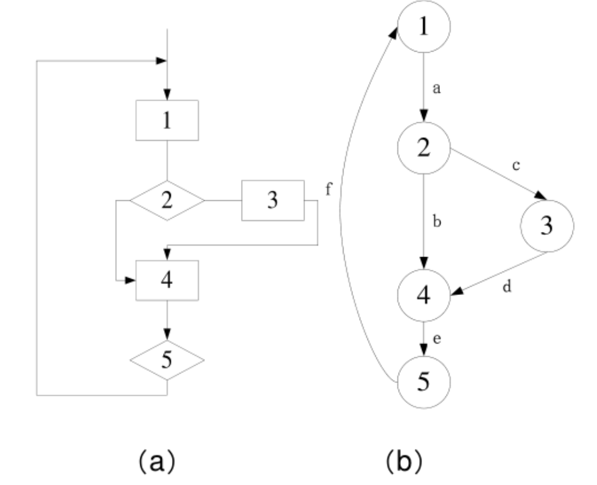
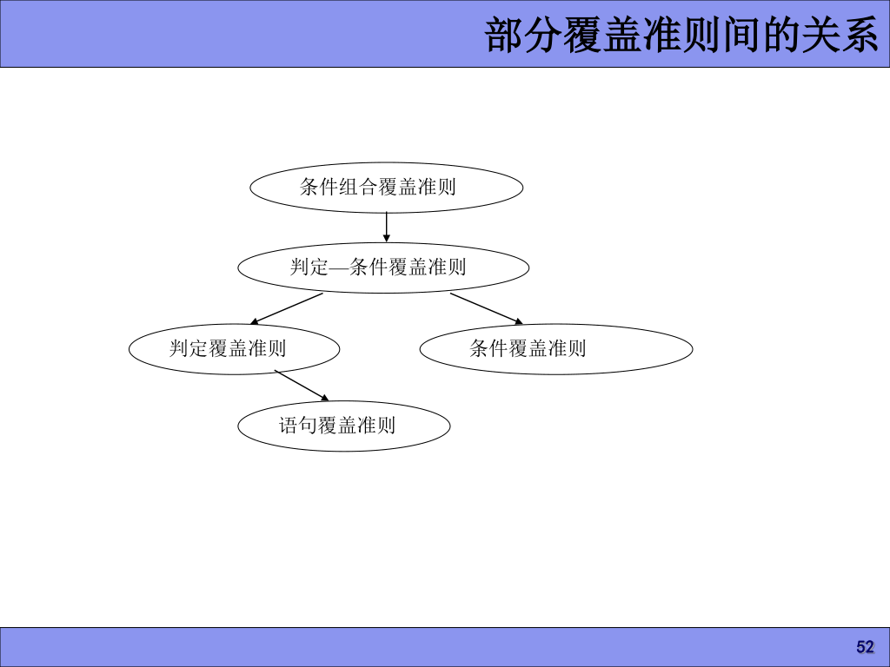

# 白盒测试
---
* 静态白盒测试是在不执行程序的条件下有条理地仔细审查软件设计、体系结构和代码，从而找出软件缺陷地过程，有时也称为结构化分析。
* 动态白盒测试又称结构化测试，利用查看代码功能和实现方式得到的信息来确定测试，可以查看并使用代码的内部结构来设计和执行用例。
* 白盒测试时基于程序的测试，覆盖测试与路径测试是其两大基本策略，是由程序内部逻辑驱动的一种单元测试方法。

### 逻辑覆盖法

* 遵循原则：
  * 保证一个模块中的所有独立路径至少被执行一次。
  * 所有逻辑值均需测试真和假两种情况。
  * 检查程序的内部数据结构，保证其结构的有效性。
  * 在上下边界及可操作范围内运行所有循环。

**程序流程图&&控制流图**
* 程序流程图又称框图。简化的程序流程图称为控制流图(Control Flow Graph)
* 控制流图的符号：
  * 节点： 标有编号的圆圈表示。
  * 控制流线或弧：以箭头表示。
* 控制流图特点：
  * 具有唯一入口节点(源节点),表示开始。
  * 具有唯一出口节点(汇节点),表示结束。
* 若判断中表达式是复合条件(>=……)，将复合条件改为一系列只有单个条件的判断。

&emsp;**程序流程图简化为控制流图**
* 合并节点： 若在一个节点序列中没有分支，则我们可以把这个序列的节点都合并成一个节点。
* 流程图中的一组顺序处理框在控制流图中可以被映射为一个单一节点。 
  
**圈复杂度**
* 圈复杂度的值是用基本集合定义程序的独立路径数。
* 给定一个控制流图G，设其圈(环形)复杂度为V(G),有三种常见的计算方法来求解V(G);
  * **V(G)=E-N+2** ，其中 E是控制流图G中边的数量，N是控制流图中结点的数目。
  * **V(G)=P+1** , 其中P是控制流图G中判断节点的数目。
  * **V(G)=A** , 其中A是控制流图G中区域的数目。 由边和结点围成的区域叫区域。当计算区域时，控制流图外的区域也应记为一个区域。

#### 覆盖测试
*   利用程序的逻辑结构设计相应的测试用例。
* 方法：
  * 语句覆盖
  * 判定覆盖
  * 条件覆盖
  * 判定——条件覆盖
  * 条件组合覆盖
  * 路径覆盖

##### 语句覆盖
* 设计若干个测试用例，程序运行时每个可执行语句至少被执行一次。
* 在控制流图中，要求所有的语句都被运行的充分必要条件是覆盖图中所有节点。
* 优缺点：
  * 优点：很直观地从源码得到测试用例，无需细分每条判定表达式。
  * 缺点：仅针对程序逻辑中显式存在地语句，对于隐藏地条件是无法测试的。 在多分支的逻辑运算中无法全面考虑。**语句覆盖式最弱的逻辑覆盖**

##### 判定覆盖
* 设计若干个测试用例，执行被测试程序时，程序中每个判断条件的真值分支和假值分支至少被执行一遍。
* 在控制流图中，所有的边必须覆盖。
* 优缺点：
  * 优点：判定覆盖具有比语句覆盖更强的测试能力，同样判定覆盖也具有和语句覆盖一样的简单性，无需细分每个判定。
  * 缺点：大部分的判定语句是由多个逻辑条件组合而成，若仅仅判断其整个最终结果而忽略每个条件取值情况，会遗漏部分测试路径。**判定覆盖仍是弱的逻辑覆盖**

##### 条件覆盖
  * 设计若干个测试用例，执行被测试程序时，程序中每个判断条件中的每个条件的可能取值至少被执行一遍。
  * 优缺点：
    * 优点:增加了对条件判定情况的测试，增加了测试路径。
    * 缺点： 条件覆盖不一定包含判定覆盖。 条件覆盖只能保证每个条件至少有1次为真，而不考虑所有的判定结果。

##### 判定——条件覆盖
* 设计足够的测试用例，使得判断条件中所有可能至少执行一次取值，同时，所有判断的可能结果至少执行一次。
  * 优点：同时满足判定、条件两种覆盖标准。
  * 缺点：未考虑条件组合的情况。

##### 条件组合覆盖
**满足条件组合覆盖的测试用例组一定满足判断覆盖、条件覆盖、判断/条件覆盖。**
* 设计若干个测试用例，执行被测试程序时，程序中每个判断条件的内部判断式的各种真假组合可能都至少被执行一遍。(使得所有可能的条件取值组合至少执行一次)
* 优缺点：
  * 优点：满足条件组合覆盖的测试用例组一定满足判断覆盖、条件覆盖、判断/条件覆盖。
  * 缺点：线性地增加了测试用例的数量。

##### 路径覆盖
* 设计所有的测试用例，覆盖程序中的所有可能执行路径。路径覆盖包含了分支覆盖。
* 优缺点：
  * 优点： 这种测试方法可以对程序进行彻底的测试，比前五种覆盖范围都广。
  * 缺点：需要设计大量、复杂的测试用例，使得工作量指数上涨。

---

### 路径测试

##### 基本路径覆盖法
* 通过将覆盖的路径数压缩、并合理地选择一组穿过程序地测试路径，确保程序中每一个语句都执行一次。
* 对某个程序所有独立路径进行测试，检验程序中每一条语句，达到语句覆盖，称之为基本路径测试。
**独立路径测试：**
* 从控制流图来看，一条独立路径是至少包含有一条在其他独立路径中从未有过的边的路径。
* 在所有路径中找到一条最复杂的路径作为基础路径(主路径)。
* 步骤
  * 导出程序控制流图
  * 求出程序圈(环形)复杂度
  * 设计测试用例(Test Case)

* 路径测试选取的一般原则
  * 必须满足逻辑覆盖的最低标准。
    * IEEE标准测试中，语句覆盖是对白盒测试的最低标准
    * IBM标准测试中，语句覆盖+判定覆盖是对白盒测试的最低标准。
  * 对单循环、嵌套循环、串接循环和不规则循环，给出相应的路径选取规则。
    * 单循环：取不同循环次数
    * 嵌套循环： 从最深层循环开始，测试不同取值，直到覆盖所有循环
    * 串接循环
      * 如果两个循环相互独立，采用简单循环。
      * 如果不相互独立，使用嵌套循环的方式。
    * 不规则循环：给它重新设计成规则的。