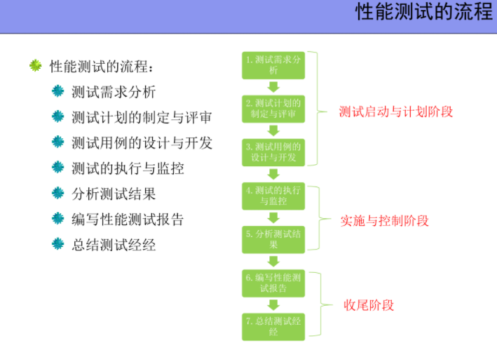

# 系统测试
* 系统测试时将已经继承好的软件系统作为整个计算机系统的一个元素，与支持软件、计算机硬件、外设、数据等其它系统元素结合在一起，在实际使用环境下，对计算机系统进行的一系列测试活动。
* 指软件投产以前，接近于日常测试的综合性检验测试，往往是很复杂的过程。
---
 #### 概述
 * 目标
   * 检验组成整个系统的代码、以及系统的软硬件配合有无错误。
   * 代码实现的系统与用户需求是否吻合。
   * 检验系统的文档等各种是否完整、有效。
   * 模拟验收测试的要求，检查系统是否符合用户的验收标准。
 * 时机：多数集成测试测试完成后
 * 方法：黑盒测试
 * 责任：测试工程师
系统测试的环境是软件真实运行环境的最逼真模拟，系统测试中，各部分研制完成的真是设备逐渐替代了模拟器。
真实性错误：
* 包括外围设备接口、输入/输出、多处理器设备之间的接口不相容，整个系统的时序匹配等。
系统测试的主要内容：(其中，功能测试、性能测试、配置测试和安装测试一般情况下是必须的)
* 功能测试
* 性能测试
* 负载测试
* 强度测试
* 容量测试
* 安全性测试
* 配置测试
* 故障恢复测试
* 安装测试
* 文档测试
* 用户界面测试
### 功能测试
* 又称正确性测试
* 规定在一段时间内运行软件系统的所有功能，以验证这个软件系统有无严重错误。测试软件系统功能是否正确。功能测试是软件测试中不可或缺的重要测试内容之一。
* 在单元测试和集成测试阶段都有。
  * 单元测试说明了代码执行是否正确。
  * 功能测试说明了**完成的功能是否做正确的事情**
  * 单元测试中的功能测试是从代码开发人员的角度来编写的
  * 系统测试中的功能测试是**从最终用户和业务流程的角度**来编写的。
  * 功能测试的大部分工作都是在系统集成测试完成后的系统测试阶段进行的。(系统功能稳定且完整)
* 功能测试一般归为 界面、数据、操作、逻辑、接口等 几个方面。
* 思路： 客户需求为导向，全面理解功能特性。
* 流程：需求分析->制定测试计划->测试设计和测试用例设计->测试环境搭建->实施->缺陷报告->回归测试
* 测试需求： 用来识别什么内容是需要进行测试的。要覆盖一些业务规则、功能以及非功能的内容。 
  * **测试需求除了需要覆盖系统应该做什么，还要覆盖系统不应该做什么**
  * 测试需求是用来发现需求中存在的问题。
  * 测试需求级别：业务功能级别->功能任务级别->事物级别/事物数据类型级别->字段校验级别
* 功能测试重点：
  * 整体性 
  * 重点性
    * 确认每项功能是否都能正常使用，符合实际要求
    * 是否实现了产品规格说明书的要求
    * ……

**功能自动化测试**
  * 功能测试在以下几种情况下引入自动化测试
    * 测试时间相对长，且存在大量重复性、机械性人工测试项目
    * 产品型软件(发布新版本or补丁) 
    * 项目型软件(需求变更频繁) 
    * 经常需要更换应用程序部署站点的软件
    * 系统界面稳定，对业务流程进行验证
    * 采用增量开发持续集成的项目
    * 软件项目采用主流开发平台技术且不存在物理交互
  * 项目工期紧 不应采取自动化
  * 界面ui和声音体验 不应采取自动化

**QTP**
* QuickTest Professional 是自动化测试解决方案，采用了关键词驱动测试的理念，能完全简化测试的创建和维护工作。
* 脚本测试？

#### 回归测试
* 目的：所做的修改达到了预定的目的，不影响软件原有功能的正确性
* 指修改了旧代码后，重新进行测试确认修改么有引入新的错误或导致其他代码产生错误。

### 性能测试
* 定义： 为了发现系统性能问题or获取系统性能相关指标而进行的测试。
* 一般在真实环境、特定负载的条件下，通过工具模拟实际软件系统的运行及操作，监控性能各项指标，最后对测试结果进行分析来确定系统性能状况。
* 性能与功能
  * 功能指在一般条件下软件系统能够为用户做什么，能够满足用户什么样的需求。焦点在于做什么。
  * 性能是在空间和时间资源有限的条件下，软件系统还能不能工作。在于做的如何。
* 衡量软件系统性能： 响应时间、吞吐量、资源使用率、点击数、并发用户数。
* 响应时间：客户端响应时间+服务端响应时间+网络响应时间
* 吞吐量：指系统在每单位时间内能处理多少个事物/请求/单位数据。
* 资源使用率：cpu/内存/磁盘IO/网络IO
* 点击数：客户端向Web Server 发起了多少次http请求，一次鼠标可能触发多个请求。(是衡量Web Server处理能力的一个很有用的指标)
* 并发用户数：度量服务器并发容量和同步协调能力， 占用套接字、句柄登操作系统资源。
* 凡是用户有关资源和实践的要求都可以被视为性能指标
* 狭义性能测试：常规的性能测试，测试系统的性能是否满足用户的性能要求。
* 广义： 压力测试、负载测试、强度测试、并发用户测试、大数据量测试、配置测试、可靠性测试等和性能相关的测试统称。
* 性能测试可以：
  * 识别系统瓶颈和产生原因
  * 最优化和调整平台配置
  * 判断新的模块是否对整个系统的性能有影响

* 性能测试不要求也无法做到覆盖软件的所有功能，通常对模块or功能做性能测试。
* 性能测试属于系统级测试。
  **负载测试**
*  对系统不断施加压力或增加一定压力下的持续时间，直到系统性能指标达到极限。
*  压力测试侧重压力大小，负载测试侧重压力持续时间。
*  负载测试关心的是用户规则和需求。
**压力测试**
* 对系统不断施加压力，通过确定一个系统的平静or不能接受用户请求的性能点，来获得系统能提供的最大服务级别的测试。
* 压力测试的极端条件可能远远高于用户的性能需求。
* 压力测试关心的是软件系统的本身。识别系统的弱点和极限负载下程序将如何运行。
* 压力测试类型：并发性能、疲劳强度、大数据量。
**强度测试**
* 检查程序对异常情况的抵抗能力，迫使系统在异常的资源配置下运行。
* 对测试系统的稳定性以及系统未来的扩展空间均具有重要的姨姨。
**基准测试**
* 将添加新模块后的性能与未添加模块后的性能做比较，未添加时是基准。
**稳定性测试**
* 测试系统在一定负载下运行长时间是否会发生问题。
**可恢复测试**
* 测试系统能否快速地从错误状态中恢复到正常状态。
**可靠性测试**
* 在给系统加载一定业务压力地情况下，使系统运行一段时间，检测系统是否稳定。
#### Web测试
* 测试内容：用户界面测试、功能/性能测试。