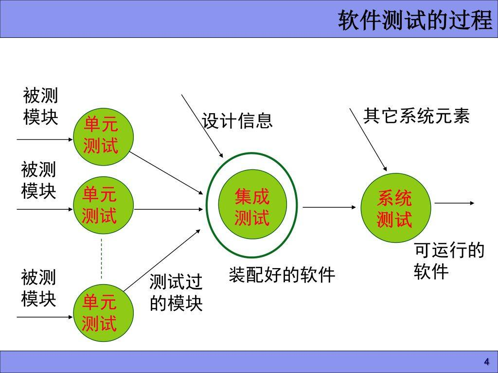
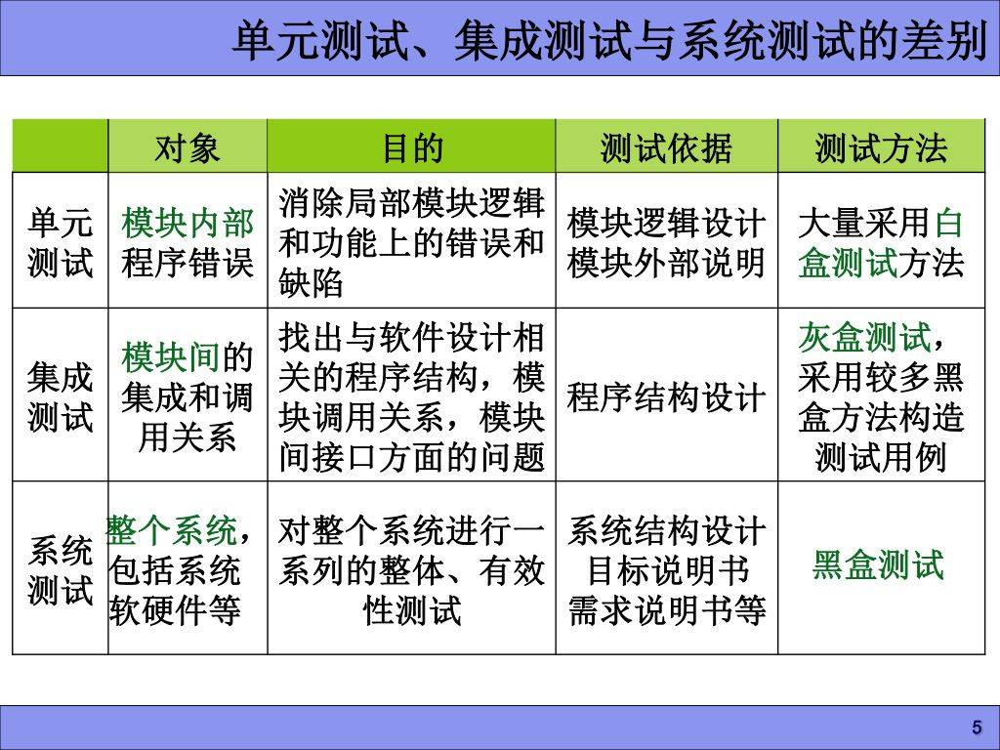
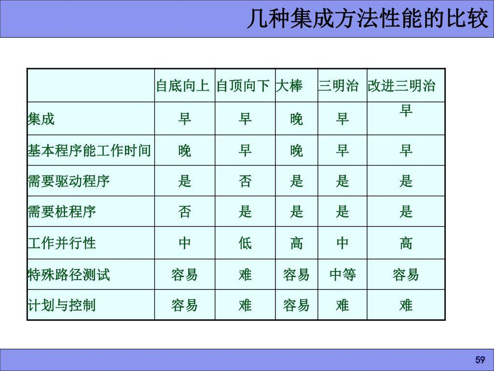
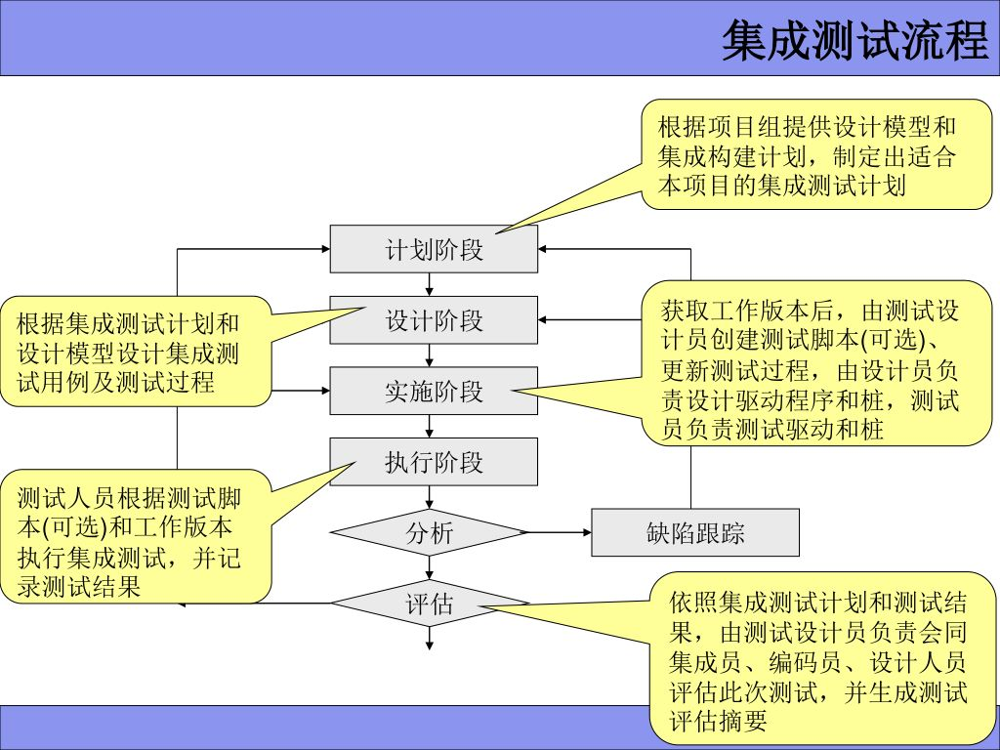

 	# 集成测试

---

* 集成测试(Integration Testing)就是测试单元在集成时是否有缺陷，是单元测试的逻辑拓展。

* 通过测试来识别单元组合时会出现的问题，也叫组装测试或联合测试，子系统测试，部件测试。

* 集成测试的方法包括基于功能分解的集成测试、基于调用图的集成测试、基于路径的集成测试等集成测试方法。

  ----

### 灰盒测试

* 介于白盒测试与黑盒测试之间的一种测试。
* 多用于集成测试阶段，在关注输出、输入的正确性的同时也关注程序内部的情况。
* 灰盒测试不如白盒测试详细、完整，但比黑盒测试关注程序内部逻辑，通过表征性的现象、事件、标志来判断内部的运行状态。

#### 集成测试理念

**为什么进行集成测试**

* 模块调用、功能组合时出现了新的问题。
* 集成测试在单元和系统测试之间起到了承上启下的作用，既能发现大量单元测试阶段不易发现的接口类错误，又可以保证在进入系统测试前及早发现错误。
* 集成测试通过模块间的交互作用和不同人的理解和交流，更容易发现实现上、理解上的不一致和差错。

**什么时候进行集成测试**

* 开始体系结构设计的时候开始制定测试方案。
* 进入详细设计之前完成集成测试方案。
* 进入系统测试之前结束集成测试。

**集成测试原则**

* 有计划执行
* 采取增量式的分步继承方式，逐步进行软件部件的集成和测试

**集成测试关注重点**

* 各个模块连接时穿越模块接口的数据是否会丢失
* 各个子功能组合后能否达到预期功能
* 一个模块是否会对另一个模块的功能产生不利影响
* 全局数据结构布局是否有问题
* 单个模块的误差积累起来是否会放大
* 集成测试关注的是模块之间的接口，接口分为以下几种类型：
  * 通信协议
  * 调用关系
  * 文件、数据库、队列、第三方中间件
  * 共享资源
  * 同步

**集成测试方案**

集成测试方案应包括以下的主要内容：

* 被测特性的分析
* 采用的集成策略
* 测试对象的详细描述和设计测试用例
* 测试结果的分析

**集成测试的层次**

* 模块内集成测试
* 子系统内集成测试：先测试子系统内的功能模块，然后将功能模块组合起来确认子系统的功能是否达到预期要求。
* 子系统间集成测试：测试的单元式子系统之间的接口。 子系统式可单独运行的程序or进程。

对面向对象的应用系统来说，分为两个层次。

* 类内集成测试
* 类间集成测试

**集成测试策略**

* 非增量方式： 测试好每一个单元，再一次组装测整个程序。	适合小型程序

  * 非增量式测试采用一步到位方法构造测试，又称大爆炸式集成。
  * 优点：方法简单，允许多人员并行工作。
  * 缺点：必须为每个模块准备相应的驱动模块和桩模块，测试成本高。
    * 集成后若包含多种错误，难以纠正。
  * 在非增量式测试中，应当确定关键模块，对这些关键模块及早进行测试。
  * 关键模块特征：
    * 完成关键功能。
    * 在程序的模块结构中处于较高的层次
    * 较为复杂、易于发生错误
    * 有明确定义的性能要求。

* 增量方式： 逐步把下一个要被组装的软件单元or部件，同已经测好的软件部件结合起来测试。

  * 增量式测试是逐步实现的
* 增量方式方法主要包括自顶向下(深度优先or广度优先),自底向上，三明治集成。
  * 自顶向下：

    * 首先集成主控模块，然后依照控制层次结构向下进行集成，采用深度or广度优先的方式。
  * 优点：
      * 较早地验证了主要控制和判断点
      * 按深度优先可以首先实现和验证一个完整的软件功能。
      * 只需一个驱动，减少驱动器开发费用。
      * 支持故障隔离
    * 缺点：
      * 桩的开发量大
      * 底层验证被推迟
      * 底层组件测试不充分。
    * 适用范围：
      * 产品控制结构清晰稳定
      * 高层接口变化较小
      * 底层接口未定义or经常被修改
      * 产品控制组件具有较大的技术风险，需要尽早验证。
  * 自底向上
  
  * 从具有最小依赖性的底层组件开始，按照依赖关系树的结构，逐层向上集成，以检验系统的稳定性。是最常用的集成策略
    * 常用的驱动模块：  调用从属模块，从表中传递参数 显示参数 兼有驱动程序B,C的功能。
  * 优点：
  
    * 对底层组件行为较早验证
    * 工作最初可以并行集成，效率较高
    * 减少了桩的工作量
    * 能较好锁定软件故障所在位置
  * 缺点：
      * 驱动开发工作量大
    * 对高层的验证被推迟，设计上的错误不能及时发现
    * 适用范围：
    * 底层接口较为稳定
      * 高层接口变化较为频繁
    * 底层组件 较早被完成
  * 三明治结成
  * 是一种混合策略，综合了自顶向下和自底向上两种集成方法的优点。
  * 当被测软件中关键模块较多时，三明治可能是最好的折中方法。
  * 优点：
    * 将自顶向下和自底向上的集成方法有机地结合起来，一般对软件结构的上层使用自顶向下结合的方法；对下层使用自底向上结合的方法，运用一定的技巧，减少了桩模块和驱动模块的开发。
  * 缺点：
    * 在被集成之前，中间层不能尽早得到充分的测试。

**测试的实施**
* 编写测试驱动和桩程序
* 根据设计的测试用例进行测试
* 为系统运行设计用例可使用的主要测试分析技术：
  * 等价类划分
  * 边界值分析
  * 基于决策表的测试
* 为正向测试设计用例
  * 1. 输入域测试
  * 2. 输出域测试
  * 3. 等价类划分
  * 4. 状态转换测试
  * 5. 规范导出法
* 为逆向测试设计用例
  * 1. 错误猜测法
  * 2. 基于风险/故障的测试
  * 3. 边界值分析
  * 4. 特殊值测试
  * 5. 状态转换测试
* 为满足特殊需求设计用例
  * 可使用主要测试分析技术为规范导出法
* 为高覆盖设计用例
  * 功能覆盖分析
  * 接口覆盖分析

---
**集成测试流程：计划->设计->执行->评估