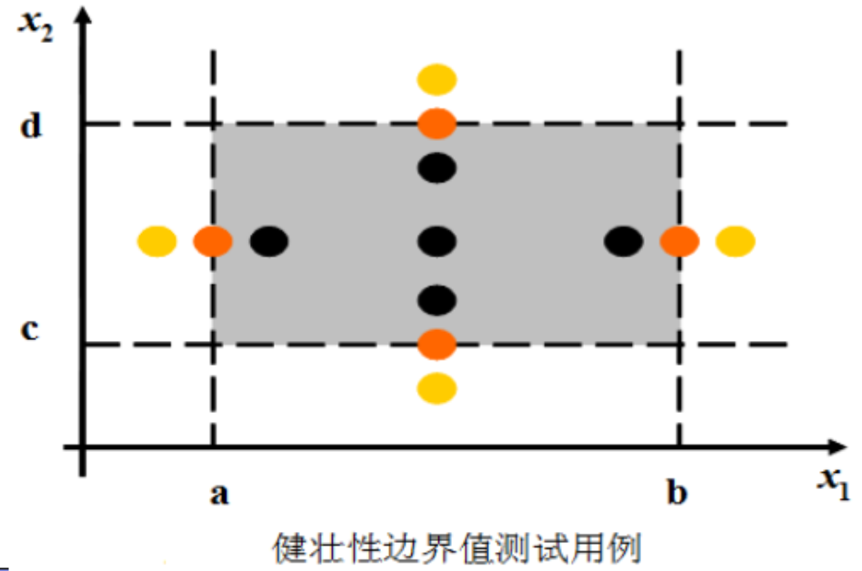
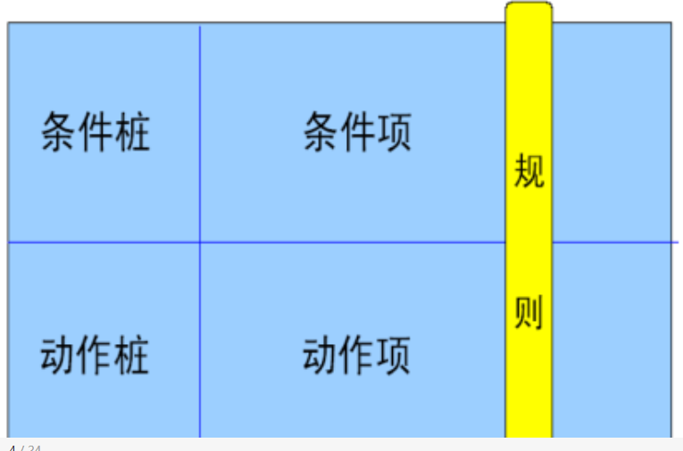
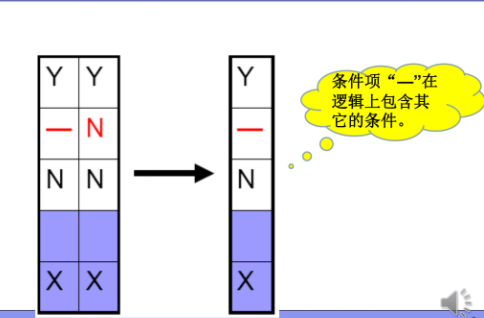
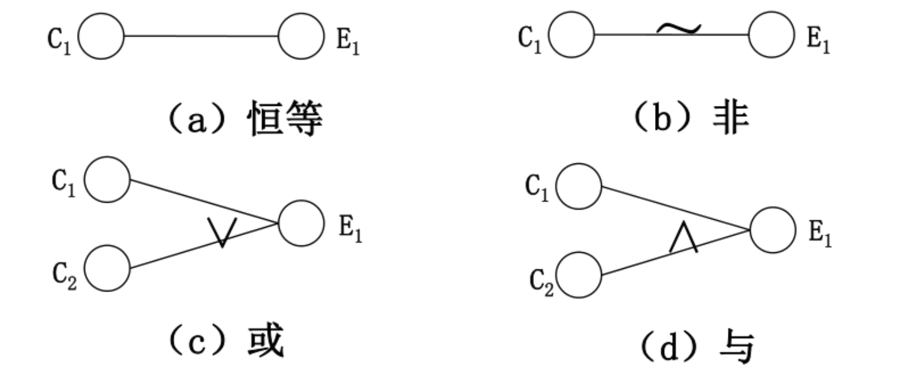
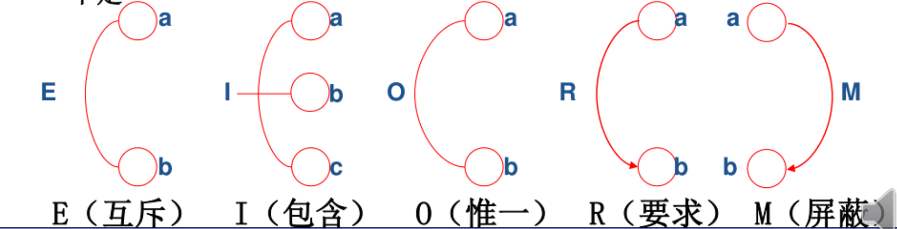
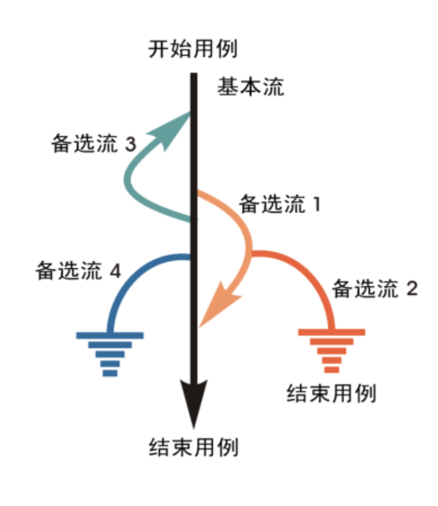

# 黑盒测试
* 黑盒测试又称功能测试、数据驱动测试或基于规格说明书的测试，是一种从用户观点出发的测试。
---
### 黑盒测试basic
**目的**
* 检查程序功能能否按需求规格说明书的规定正常使用，测试各个功能是否有遗漏，检测性能等特性要求是否满足。 
* 检测人机交互是否错误，检测数据结构或外部数据库访问是否错误，程序是否能适当地接收输入数据而产生正确地输出结果，并保持外部信息的完整性。
* 检测程序初始化和终止方面的错误。
**黑盒测试的错误类型**
* 不正确或遗漏的功能。
* 接口、 界面错误
* 性能错误
* 数据结构或外部数据访问错误
* 初始化或终止条件错误等等

> 白盒测试在测试的早期采用，而黑盒测试作用于测试的后期。黑盒测试不考虑控制结构而是注意信息域。

**黑盒测试和白盒测试的区别**
* 黑盒测试只能观察软件的外部表现，程序可能用错误的运算方式得出正确的结果。(代码不知道为什么能运行起来.jpg),只有白盒测试才能发现真正的原因。
* 白盒测试能发现程序里的隐患，像内存泄漏、误差累积等问题。在这方面黑盒测试并不能做到。
* 通过白盒测试只能证明程序符合设计要求，并不能保证符合用户需求。
* 黑盒测试和白盒测试都不能取代对方。
**黑盒测试的标准测试用例集**
* 所设计的测试用例能够减少达到合理测试所需的附加测试用例数。
* 所设计的测试用例能够告知某些类型错误的存在or不存在，而不仅仅是与特定测试相关的错误。

**黑盒测试的实施过程**
* 测试计划阶段
* 测试设计阶段
  * 依据程序需求规格说明书or用户手册，按一定规范化的方法进行软件功能划分和设计测试用例。
* 测试执行阶段
  * 按照设计的测试用例执行测试;
  * 自由测试。
* 测试总结阶段

## 黑盒测试方法
----
### 等价类划分
* 定义： 它是用黑盒测试发设计测试用例的一种技术，它将不能穷举的测试过程进行合理的分类，从而保证设计出来的测试用例具有完整性和代表性。(可以应用在所有测试级别中)
* 方式： 将程序(模块)输入定义域中所有可能的输入数据(有效、无效)划分成如干个等价类，每一类的一个代表性的数据在测试中的作用就等价于这一类中所有的数据。
**测试某等价类的代表值就是等效于对于这一类其他值的测试**
* 所有等价类的并集就是整个输入域。
* 划分等价类的标准
  * 完备性
  * 无冗余性
* 等价类划分： 有效等价类（符合程序规格说明书）和无效等价类。
 ---
### 边界值分析
**定义：边界值分析法就是对输入或输出的边界值进行测试的一种黑盒测试方法。**
**思想：故障往往出现在输入变量的边界值附近。**
* 边界值：
  * [0,100],0和100就是边界值。
* 内部边界值条件/子边界值条件：用户难注意到，但在检测范畴内的边界条件。
**两个可靠性理论的假设**
* 单缺陷假设： 失效极少是由两个或两个以上的缺陷同时发生而引起的。
  * 基于单缺陷假设：每次保留程序中的一个变量，让其余的变量取正常值，被保留的取min,min+,nom,max,max-;
* 多缺陷假设：失效是由两个或两个以上缺陷同时作用而引起的。
  * 基于多缺陷假设：在选取测试用例时同时让多个变量取边界值。
* 边界值分析：
  * 边界值分析的基本思想是使用输入变量的最小值、略大于最小值、正常值、略小于最大值和最大值设计测试用例。
  
**对于一个含有n个变量的程序，采用边界值分析法测试程序会产生4n+1个测试用例。**
**健壮性边界测试**
* 健壮性边界测试除了对变量的五个边界值分析取值外，还需增加一个略大于最大值和略小于最小值的取值。
  
* 对于有n个变量的函数采用健壮性测试需要**6n+1**个测试用例。
**最坏情况测试拒绝单缺陷假设。对输入变量要取笛卡尔积进行计算。**
* 对于有n个变量的函数采用最坏情况测试需要**5^n**个测试用例。
**健壮性最坏情况测试是最欢情况测试的拓展。对七个元素的集合取笛卡尔积。**
* 对于有n个变量的函数采用健壮性最坏情况测试需要**7^n**个测试用例。
  
### 判定表法（决策表法）
**在所有的黑盒测试方法中，基于判定表的测试是最为严格、最具有逻辑性的测试方法。**
* 判定表是分析和表达多逻辑条件下执行不同操作的工具。

  * 条件桩(Condition Stub)
    * 列出问题的所有条件
  * 动作桩(Action Stub)
    * 列出可能采取的操作
  * 条件项(Condition Entity)
    * 列出条件桩的取值
  * 动作项(Action Entity)
    * 列出条件项各种区直辖应该采取的动作
* 任何一个条件组合的特定取值及其相应要执行的操作称为规则
* 在判定表中贯穿条件项和动作项的一列就是一条规则。
* 条件项和动作项有多少列就有多少条规则。 
**规则合并**
* 规则合并就是判定表的简化。
* 有两条或者多条规则具有相同的动作，并且其条件项之间存在着相似的关系，就可以将规则合并。

* 判定表的用法：
  * 列出所有条件桩和动作桩
  * 确定规则的个数
    * 假如有n个条件，每个条件有2个取值，就有2^n中规则。
  * 填入条件项
  * 填入动作项，得到初始决策表
  * 简化合并相似规则。 
### 因果图法
**定义：因果图是一种描述输入和输出之间关系的图**
* 等价类和边界值着重考虑输入条件，但是没有考虑输入条件的各种组合、输入条件之间的相互制约关系。
* 利用图解法分析输入的各种组合情况，从而设计测试用例的方法。
* 因果图法比较适合输入条件比较多的情况，测试所有的输入条件的排列组合。原因->输入，结果->输出。
* 基本符号：节点和弧线
  * 节点表示原因or结果的状态。原因用字母C表示，结果用e表示。状态的取值为0或1.
* 原因和结果之间的关系：
  * 恒等：若原因出现，则结果出现。若原因不出现，则结果不出现。
  * 非(~):若原因出现，则结果不出现；若原因不出现，则结果出现。
  * 与(∧)：若几个原因都出现，则结果出现，若其中有一个原因不出现，则结果不出现。
  * 或(∨)：若几个原因中有一个出现，则结果出现；若几个原因都不出现，则结果不出现。
  
* 因果图约束符号：
  * E(互斥：exclusive)(异): 表示两个原因不会同时成立，两个中最多有一个可能成立。
  * I(包含：inclusive)(或): 表示三个原因中至少有一个必须成立
  * O(唯一：only one): 表示两个原因中必须有一个、且仅有一个成立。
  * R(要求：request): 表示两个原因，a出现时，b也必须出现，a出现时，b不可能不出现。
  * M(屏蔽：masking)(强制):两个结果，a为1时b必须为0，当a为0时b的值不确定。
 
* 因果图法设计测试用例步骤：
  * 分析程度规格说明，找出原因结果。
  * 分析描述中语义内容，并将其表示成连接各个原因以及各个结果的"因果图";
  * 标明约束条件。
  * 把因果图转换成判定表。
  ---
  ### 其他方法
  #### 场景法
  **本质上，场景从用户的角度描述系统的运行行为，反映了系统的期望运行方式。**
  * 该方法主要用于功能测试。
  
  * 在场景法中测试一个软件时，测试流程时软件功能按照正确的事件流实现的一条正确流程，称之为软件的基本流。
  * 出现故障or缺陷的过程，就用备选流加以标注，备选流可以从基本流开始，在某个特定条件下执行，然后重新加入基本流中。也可能起源于另一个备选流，或终止用例不再重新加入某个流。
  * 每个场景都至少对应一组输入和一个预期输出结果，即测试用例。
* 根据图中每个经过用例的可能路径，可以确定不同的场景。
  * 最少的场景数等于事件流的总数，即基本流和备选流的总数。
  * 有且唯一有一个场景仅包含基本流。
  * 对应于某个备选流，至少应有一个场景覆盖该备选流，且在该场景中应尽量避免覆盖其他的备选流。

#### 正交实验法
* 正交试验法是研究多因素、多水平的一种设计方法，是一种基于正交表的试验设计方法。
* 正交表记为Ln(m^k).
  * L是正交表的符号，
  * n是行数，代表试验(测试)次数。
  * k是列数，为因素(变量、因子)数。
  * m是水平数，即每个因素(变量)的取值个数。
* 行数(即试验次数) = Σ(每列水平数 -1) +1
* 正交表的正交性：
  * 整齐可比性
  * 均衡分散性
* 正交表选择数据思想： 
  * 公平：每个因素都要参与组合，每个变量的取值参与组合的次数尽量相同
  * 均匀：从所有的组合数据中，均匀、零星的挑选作为用例的组合数据，而不只是从某个局部选取
* 当因素数不同的时候
  * 取因素数最接近但略大的实际值的表
* 当水平数不相同时
  * 少数服从多数原则、具有相同水平数的因素数多，则按该因素的水平数选正交表
  * 按取值最多的原则：看哪个因素取值最多